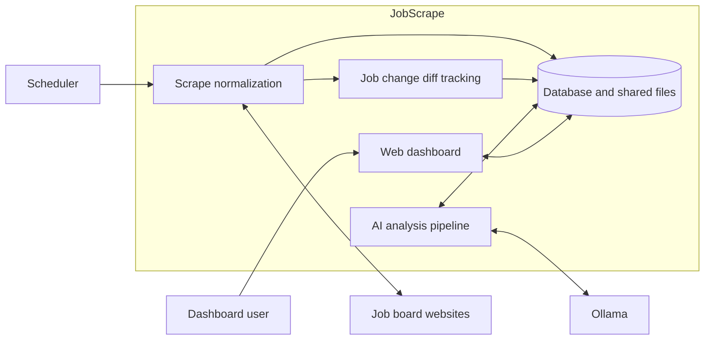
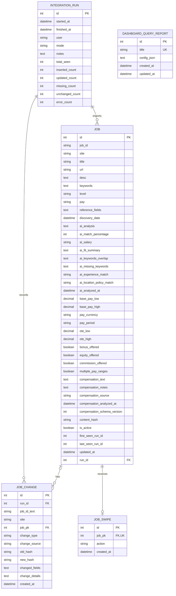

# HeadHunter
This suite of tools will help you apply and select jobs quicker. If you are specifically interested in being the first person to apply for jobs posted by particular companies, this might be the best way.

## Quick Start

```bash
# 1) Install
pip install -r requirements.txt
# .env should contain DATABASE_URL, optional logging & mode vars

# 2) Verify NLTK data
python run.py download

# 3) Run with your steps
python run.py steps

# or run test plan
python run.py test
```

`python run.py test` is extraction-only. It reads `test.json`, writes raw job snapshots to `output/<site>_job_postings.json`, prints missing-field counts for the fields actually collected, and shows a colored 3-job sample table with jobs as rows and dynamically collected fields as columns in extraction order. Set `NO_COLOR=1` to disable table colors. It does not initialize the database, create an `IntegrationRun`, insert/update jobs, or mark missing jobs.

## Must-Know Project Setup

- `requirements.txt` and `pyproject.toml` should list the same runtime/test dependencies with exact pins. Use `python-dotenv`, not the deprecated `dotenv` package, because the code imports `from dotenv import load_dotenv`.
- Dependency pins are intentionally conservative and should be changed one package at a time. Before changing or adding a package, check Snyk or another vulnerability database for high or critical issues.
- Database setup is centralized in `app/db.py`. `DB_URL` wins first, then `config.json` `DB_URL`, then the `DB_USER`/`DB_PASS`/`DB_HOST`/`DB_PORT`/`DB_NAME` pieces, then local SQLite at `data/jobs.db`.
- Shared helper code lives under `app/`: file/JSON helpers in `app/file_utils.py`, JSONL event log helpers in `app/event_log.py`, safe JSON parsing in `app/json_utils.py`, and steps suggestion merge logic in `app/steps_suggestions.py`. Add reusable helper behavior there instead of copying small functions into top-level scripts.
- JobScrape stores naive UTC values in SQL `DATETIME` columns. MySQL sessions are set to `+00:00`; the dashboard converts stored UTC values to the configured display timezone and includes the local timezone abbreviation in displayed timestamps. Do not write local wall-clock values directly to database timestamp columns.
- The dashboard backend is in `dashboard.py`; page markup lives in `templates/index.html`, `templates/steps.html`, and `templates/swipe.html`.
- Dashboard UI changes should reuse the shared `templates/_dashboard_ui.html` tokens and the `dashboard-page`, `dashboard-shell`, `dashboard-card`, `dashboard-tab`, `dashboard-button`, `dashboard-control`, `dashboard-table`, and `dashboard-message` classes instead of inventing new one-off card or button styles. Keep new work inside the existing slate/indigo system unless there is a strong product reason to change it.
- The dashboard templates currently load Tailwind, Alpine, and Chart.js from public CDNs, so the dashboard needs internet access unless those assets are vendored locally later.
- AI job matching is a batch classification task. For max-quality local analysis with `deepseek-r1:8b`, use `OLLAMA_THINK=medium`, full inputs with `MAX_RESUME_TOKENS=0` and `MAX_JOB_DESC_TOKENS=0`, `OLLAMA_NUM_PREDICT=6144`, and `AI_THINKING_RETRY_NUM_PREDICT=12288`. `AI_CONCURRENCY=2` is the first throughput bump; if logs show repeated long waits, timeouts, or more `done_reason='length'` failures, drop back to `AI_CONCURRENCY=1` and `AI_MAX_INFLIGHT=1`. `analyze_jobs_ollama.py` verifies that Ollama and the configured model are available before submitting work, tries `ollama serve` once when the local API is not reachable, and retries reasoning-budget exhaustion with `AI_THINKING_RETRY_NUM_PREDICT` before giving up.
- `analyze_jobs_ollama.py` now runs as a three-stage AI pipeline. Stage 1 performs the initial resume/job match analysis and structured compensation extraction. Stage 2 reviews successful Stage 1 JSON and stores only the final reviewed result in the existing `jobs` AI fields; by default it reviews every successful result, and `AI_REVIEW_MIN_MATCH` / `AI_REVIEW_MAX_MATCH` can limit review to a score range. Stage 3 creates applicant-facing Fit Briefs for active jobs with final `ai_match_percentage >= 75` (`AI_FIT_BRIEF_MIN_MATCH`) and stores them in `job_fit_briefs`.
- Fit Briefs are generated from `prompts/fit_brief_system.txt` and contain score explanation, strongest matches, gaps, risk flags, interview angle, and exact mapped bullets from `resume.txt`. They intentionally do not include `resume_keywords_to_emphasize`, because keyword overlap and missing keywords are handled by the main analysis fields. A mapped `resume_bullet` must be exact text from `resume.txt`; validation rejects invented or rewritten bullets.
- Fit Brief freshness is controlled by the stored resume hash, job content hash, and Fit Brief schema version. Re-run `python .\analyze_jobs_ollama.py --fit-briefs-only` to fill missing or stale briefs for already analyzed eligible jobs, or add `--force` to regenerate existing briefs. The default `python .\analyze_jobs_ollama.py` flow runs Stage 1, Stage 2, and then Stage 3 for eligible reviewed matches. `--compensation-only` keeps its existing compensation cleanup behavior and does not run Fit Brief generation.
- Liking a job in Swipe now means `Move forward`: it records the normal `job_swipes` row and queues a separate Application Prep artifact in `job_application_preps`. The `Interesting` swipe action saves a job for later review without queuing Application Prep. Application Prep uses `prompts/application_prep_system.txt`, runs before lower-priority AI backlog work, processes queued jobs newest-first, and returns grounded resume improvements plus draft resume bullets backed by exact resume evidence.
- Application Prep has its own Ollama generation settings because it must produce complete JSON rather than a short classification result: `APPLICATION_PREP_THINK=false`, `APPLICATION_PREP_NUM_PREDICT=4096`, and `APPLICATION_PREP_RETRY_NUM_PREDICT` defaults high enough to retry truncation without changing the main analyzer's `OLLAMA_THINK`.

### Timestamp data migration

Existing databases created before the UTC convention contain a mix of UTC discovery times and Central-time run, analysis, change, swipe, update, and report times. Stop the scraper, AI scheduler, and dashboard before applying the one-time repair. The command is a dry run unless `--apply` is supplied:

```powershell
python .\scripts\migrate_timestamps_to_utc.py
python .\scripts\migrate_timestamps_to_utc.py --apply
```

The migration leaves `jobs.discovery_date` unchanged, creates database backup tables named `jobscrape_tz_20260717_*`, converts only JobScrape-owned columns with Python's DST-aware `zoneinfo`, and refuses to apply twice. To restore the original values, stop all writers and run `python .\scripts\migrate_timestamps_to_utc.py --restore`. Read-only post-migration queries are in `scripts/sql/verify_timestamp_utc.mysql.sql`.

### Solution architecture



The scheduled pipeline collects job postings, normalizes them, records insert/update/missing changes, and then analyzes stored jobs. Change tracking writes compact field summaries plus rich before/after details for future dashboard diffs.

### Database entity relationships

The diagram covers the persistent SQLAlchemy classes in `app/models.py` plus the dashboard-owned `DashboardQueryReport` class in `dashboard.py`. Utility classes and in-memory dataclasses are not database entities, so they are not included.



`jobs` has a composite unique constraint on `(job_id, site)`, because the same natural job ID may occur on different sites. `job_swipes.job_pk` is unique, enforcing at most one swipe per job. `job_changes.job_pk` is nullable, so a change always belongs to one integration run but may have no associated job row. `job_changes.changed_fields` remains the compact field summary used by filters and exports; `job_changes.change_details` stores versioned JSON before/after snapshots for new scraper changes so the dashboard can render red/green content diffs when a change row is expanded. Older change rows may only have `changed_fields`, and the dashboard shows those as legacy rows without detailed content. `jobs.first_seen_run_id` and `jobs.last_seen_run_id` store run identifiers for tracking, but they are not declared foreign keys; the diagram therefore leaves them as ordinary attributes. `dashboard_query_reports` is standalone and has no foreign-key relationships.

Fields routed through HTML cleanup are decoded before parsing, so escaped markup like `&lt;p&gt;`, `&amp;nbsp;`, and double-escaped text like `R&amp;amp;D` are normalized to readable text during ingestion.

## Ollama-Guided Job Board Discovery

`discover_job_boards.py` helps find new company career pages and job boards to add to `steps.json`. Python does the page fetching and link extraction; Ollama reads the resume, evaluates page/link batches, and decides which pages are worth inspecting or suggesting.

V1 is bounded and city-level:

- It starts from `config/job_discovery_seeds.json`, or falls back to `config/job_discovery_seeds.example.json`.
- It expands those seeds with lightweight Bing RSS search queries generated from the resume criteria.
- It reads `resume.txt` to infer target roles, skills, seniority, remote preference, and city/state location.
- It does not use a paid search API, geocode a zipcode, or perform radius filtering.
- Search expansion is controlled by `enable_search`, `search_templates`, `max_search_queries`, and `max_search_results_per_query` in the seed config. Search can be disabled with `--no-search`.
- It writes review files under `output/` and does not change `steps.json` directly.

Run discovery:

```powershell
python .\discover_job_boards.py
```

Useful options:

```powershell
python .\discover_job_boards.py --resume resume.txt --seeds config/job_discovery_seeds.json --max-pages 25 --max-depth 2
python .\discover_job_boards.py --max-search-queries 20 --max-search-results 10
python .\discover_job_boards.py --no-search
python .\discover_job_boards.py --dry-run
```

Outputs:

- `output/job_board_discovery.json` contains the crawl evidence and generated suggestions.
- `output/steps_suggestions.json` contains pending dashboard review items.
- `output/job_board_discovery_events.jsonl` contains the live journey log, one JSON event per line.

Open the dashboard and use the `Discovery` tab to watch the journey log and review suggestions. The journey log shows events such as criteria extraction, page fetches, Ollama triage, next URL selection, and suggestion creation. Applying selected suggestions creates a timestamped `steps.json` backup, skips duplicate site keys or duplicate load URLs, and marks applied suggestions as `applied`. Unknown/custom sites are marked for manual selector review; known ATS pages such as Workday, Greenhouse, and Lever get stronger starter templates.

Search expansion depends on normal web access to Bing RSS and may return fewer results if the endpoint rate-limits, blocks, or changes response format. In that case the script logs the failed search event and continues with configured seeds.

## Ubuntu / OrangePi 5 Deployment

The scraper uses Selenium with Chrome-compatible browsers. On Ubuntu servers, Chromium is supported; set the scraper to headless mode and point Selenium at Chromium/ChromeDriver if auto-discovery cannot find them.

Install Python venv support, Chromium, and ChromeDriver:

```bash
sudo apt update
sudo apt install -y python3-venv python3-pip chromium-browser chromium-chromedriver
```

Some Ubuntu images package Chromium as `chromium` instead:

```bash
sudo apt install -y chromium chromium-driver
```

Create and activate the virtual environment from the repo root:

```bash
cd /path/to/JobScrape
python3 -m venv .venv
source .venv/bin/activate
python -m pip install --upgrade pip
python -m pip install -r requirements.txt
```

Recommended `.env` values for a headless OrangePi server:

```env
HEADLESS=true
CHROMIUM_BINARY_PATH=/usr/bin/chromium-browser
CHROMEDRIVER_PATH=/usr/lib/chromium-browser/chromedriver
```

If Chromium is installed through Snap, use:

```env
CHROMIUM_BINARY_PATH=/snap/bin/chromium
```

The app also checks `BROWSER_BINARY_PATH`, `CHROME_BINARY_PATH`, `CHROMIUM_BINARY_PATH`, then common `PATH` names like `chromium`, `chromium-browser`, and `google-chrome`. If `chromedriver` is on `PATH`, `CHROMEDRIVER_PATH` can be omitted.

If `HEADLESS=false` and Chrome cannot open a visible browser window, the scraper retries once in headless mode so a scheduled run is not missed. Servers should still set `HEADLESS=true` directly.

If cron logs `DevToolsActivePort file doesn't exist`, first confirm the server `.env` has `HEADLESS=true`, then test Chromium outside Selenium:

```bash
/usr/bin/chromium-browser --headless=new --no-sandbox --disable-dev-shm-usage --remote-debugging-port=9222 --user-data-dir=/tmp/jobscrape-chrome-test about:blank
```

If that starts without immediately crashing, stop it with `Ctrl+C` and clean up the temporary profile:

```bash
rm -rf /tmp/jobscrape-chrome-test
```

To run manually on the server:

```bash
source .venv/bin/activate
python run.py download
python run.py steps
```

`python run.py download` installs the NLTK tokenizer and tagger data used by preprocessing. Run it after dependency installs or venv rebuilds; current NLTK versions need both `punkt` and `punkt_tab` for sentence tokenization.

The files under `scripts/run-scheduled.ps1`, `scripts/install-scheduled-task.ps1`, and `scheduler/` are Windows Task Scheduler support. For Ubuntu, schedule `/path/to/JobScrape/.venv/bin/python /path/to/JobScrape/run.py steps` with cron or a systemd timer.

### Dashboard systemd service

Use Gunicorn behind a systemd service for a dashboard that starts at boot and restarts after failures.

#### 1. Prepare the application

Install or refresh dependencies in the existing virtual environment:

```bash
cd /opt/joey/JobScrape
source .venv/bin/activate
python -m pip install -r requirements.txt
```

Confirm `/opt/joey/JobScrape/.env` contains the database and dashboard settings required by this host.

#### 2. Create the service

Create `/etc/systemd/system/jobs-dashboard.service`:

```ini
[Unit]
Description=JobScrape dashboard
After=network-online.target
Wants=network-online.target

[Service]
Type=simple
User=joey
Group=joey
WorkingDirectory=/opt/joey/JobScrape
EnvironmentFile=/opt/joey/JobScrape/.env
ExecStart=/opt/joey/JobScrape/.venv/bin/gunicorn --workers 2 --bind 0.0.0.0:5000 dashboard:app
Restart=always
RestartSec=5

[Install]
WantedBy=multi-user.target
```

The service runs as `joey`, loads the project `.env`, starts two Gunicorn workers, and restarts five seconds after a failure. Adjust the user, group, working directory, or port if the deployment uses different values.

#### 3. Start and verify

```bash
sudo systemctl daemon-reload
sudo systemctl enable --now jobs-dashboard.service
sudo systemctl status jobs-dashboard.service
```

`enable --now` both starts the service immediately and enables it at boot.

#### 4. Operate the service

```bash
sudo systemctl restart jobs-dashboard.service
sudo systemctl stop jobs-dashboard.service
sudo systemctl start jobs-dashboard.service
sudo journalctl -u jobs-dashboard.service -f
```

After changing the service file, run `sudo systemctl daemon-reload` before restarting. Changes to application code or `.env` only require a service restart.

#### Network access

- The example service listens on all interfaces at port `5000`. Open `http://<orange-pi-ip>:5000/` from another machine on the LAN.
- To restrict access to the server itself, change the Gunicorn bind address to `127.0.0.1:5000` and restart the service.
- When running `python dashboard.py` directly, `DASH_HOST` and `DASH_PORT` control the bind address. The direct runner loads the same project `.env` as `run.py`.

#### Deployment boundaries

- The dashboard does not import or run `discover_job_boards.py`.
- A hosted dashboard only needs the database, `steps.json`, and generated review files under `output/`.
- The discovery crawler can run separately on a GPU host and publish its review files back to the dashboard host.

### Dashboard features

#### Run metrics API

The run dashboard visuals hydrate from `GET /api/runs/summary?days=<1-365>`. The response is JSON with domain rows under `daily` plus `recent_runs`; the older `/api/data` endpoint remains as a compatibility adapter for clients that still expect chart-shaped arrays.

- Daily counts are unique daily job impact, deduplicated by `(site, job_id_text)` from `job_changes`.
- If one job has several changes in a day, an insert wins; otherwise the final daily missing state wins; otherwise the job counts as updated.
- `baseline_total_seen` is the largest `integration_runs.total_seen` value recorded for that local dashboard day, not the sum of repeated runs.
- `change_rate_pct` is `(inserted + updated + missing) / baseline_total_seen * 100`.
- `net_rate_pct` is `(inserted - missing) / baseline_total_seen * 100`.
- Historical unique unchanged/seen jobs are not exact because unchanged per-job observations are not stored; the dashboard keeps unchanged detail on individual recent runs.

#### Query Builder

The Query Builder searches and filters stored jobs through `/api/jobs/query`.

- Quick filters cover recency, AI match score, location policy, and text.
- AND/OR filter groups use an allowlisted field and operator set.
- Date-like columns such as `discovery_date`, `updated_at`, `ai_analyzed_at`, `compensation_analyzed_at`, and `latest_change_at` support relative values like `48`, `14d`, `2w`, or `8h`, plus absolute date/time ranges in the builder.
- Column headers toggle ascending/descending sort for the current report, and the active sort is shown with an arrow in the table header.
- Available columns include core job data, AI fields, latest change fields, raw long-text fields, and dynamic `reference_fields` values.
- Selected columns can be reordered by drag/drop or the Up/Down controls. The same order is used by the table and CSV/JSON exports.
- The table returns up to 500 rows; exports return up to 5000 rows.
- Blank or `0` minimum match includes jobs without an AI score. Values from `1` through `100` require a non-null score at or above the selected minimum.
- The legacy `/api/jobs` endpoint accepts both `hours=all` and `hours=0` as all-time aliases.

#### Saved reports

Report presets are stored in the dashboard-owned `dashboard_query_reports` table, which is created on first use when missing.

- A loaded report shows `Unsaved changes` when its filters, limits, text, or column layout differ from the stored version.
- Saved reports also persist the current sort field and direction.
- Switching reports with unsaved edits requires confirmation.
- `Save changes` updates the loaded report; `Save as new` creates a separate preset with a unique name.
- Renaming changes only the stored name and does not save unrelated builder edits.
- Existing API clients can continue using `POST /api/query-reports` as an upsert. The UI sends `create_only: true` for Save as new so duplicate names return a validation error instead of overwriting a report.

#### Background query behavior

- The browser starts `/api/jobs/query?background=1`, then polls `/api/jobs/query/<query_id>` until the query completes or expires.
- Poll responses expose stable status fields including `query_id`, `status`, `created_at`, `age_seconds`, `poll_after_ms`, and an optional `message`.
- The UI blocks builder changes while a query is running, displays a short query ID, ignores stale responses, and retries temporary polling failures.
- Status and result files are stored under `output/dashboard_query_jobs` by default, allowing polling to work across multiple Gunicorn workers.
- Change history is loaded only when selected columns or filters require `latest_*` fields or `changes_json`.
- HTTP failures appear in the query status area with the response status and backend detail when available.

#### Job lookup and swipe review

- Job lookup searches by natural job ID or keyword and displays both `jobs.job_id` and the database primary key `jobs.id` for cross-referencing.
- Additional extracted fields are stored in `jobs.reference_fields` and shown in job details.
- The swipe review page is available at `http://<orange-pi-ip>:5000/swipe` and records reviews in the dashboard-owned `job_swipes` table.
- The Application Prep deck is available in the dashboard and shows move-forward jobs with `queued`, `running`, `done`, `failed`, or `stale` processing status. The deck polls while queued or running jobs exist.
- The Interesting deck shows jobs marked `Interesting` from Swipe for later manual review without application-specific AI processing.
- The dashboard creates the swipe table on first use, so Google Sheets credentials are not required.

### Steps editor

The dashboard also hosts a visual steps builder and raw JSON editor for `steps.json` at `http://<orange-pi-ip>:5000/steps`. Use the builder when you want to add a blank site and assemble new scraper steps as blocks; use the raw JSON tab when you need full-file control or need to edit an existing complex site directly.

Important details:

- The builder is add-only for the first pass. It writes the same `steps.json` shape as the raw editor and does not introduce a new schema.
- The raw JSON tab remains the fallback for editing any field in the full file.
- The Diff Preview tab validates JSON syntax, verifies scraper actions and required fields against the supported `StepScraper` schema, and shows a GitHub-style red/green diff automatically.
- The file must remain a top-level JSON object keyed by site name.
- Saving writes pretty-printed JSON and creates a timestamped `.bak` file next to `steps.json`.
- If the preview has no changes, saving is skipped and no backup is created.

### Job Swipe

Job Swipe uses the same database connection as the scraper and dashboard. It queues active jobs that do not yet have a row in `job_swipes`, sorted newest first. Clicking `Dislike`, `Interesting`, or `Move forward` inserts or updates one `job_swipes` row for that job and removes it from future queue loads.

Important details:

- `job_swipes.job_pk` points at `jobs.id` and is unique, so each job has one current review action.
- The review action is stored as `dislike`, `interesting`, or `like`; `Move forward` stores `like`.
- `interesting` is for jobs worth revisiting later when you are not ready to apply, and does not queue Application Prep.
- A `like` creates or refreshes one `job_application_preps` row for that job and starts a best-effort dashboard worker. The normal analyzer also prioritizes queued Application Prep work before lower-priority backlog jobs.
- The swipe page shows AI keyword matches and missing keywords from the analyzer. It does not show the local NLTK keyword extraction, which is kept for historical job metadata and broader dashboard use.
- The swipe page no longer reads `SHEET_ID`, `SHEET_NAME`, or `GOOGLE_CREDENTIALS_PATH`.
- If you deploy with an existing database user, it must have permission to create the missing `job_swipes` table the first time `/swipe` or `/api/swipe/jobs` is opened.

### Application Prep

Application Prep is for jobs you decide to move forward with. It is intentionally separate from Fit Briefs: Fit Briefs summarize fit for high-score jobs, while Application Prep produces job-specific resume edits and draft bullets for a selected application target.

Important details:

- Output is stored in `job_application_preps.prep_json` with resume hash, job content hash, schema version, queue timestamps, generated timestamp, status, and error text.
- The prompt lives at `prompts/application_prep_system.txt` and can be edited under version control.
- Draft resume bullets must be grounded in exact `resume.txt` evidence. They are review-ready drafts, not invented experience.
- Status values are `queued`, `running`, `done`, `failed`, and `stale`. A done prep becomes stale when the resume hash, job content hash, or schema version changes.
- Process only the Application Prep queue with:

```powershell
python .\analyze_jobs_ollama.py --application-prep-only
```

- Add `--force` to regenerate existing move-forward prep rows. Selection is LIFO by `queued_at`, so the most recently moved-forward job is processed first.

### Cron scraper run

Edit the user crontab:

```bash
crontab -e
```

Run the scraper every day at 6:00 AM:

```cron
0 6 * * * cd /opt/joey/JobScrape && /opt/joey/JobScrape/.venv/bin/python /opt/joey/JobScrape/run.py steps >> /opt/joey/JobScrape/logs/cron-run.log 2>&1
```

Check cron output:

```bash
tail -f /opt/joey/JobScrape/logs/cron-run.log
```

## Features
- Delta tracking with `Job` + `JobChange` + `IntegrationRun`
- Dashboard Integration Runs view with daily charts and a last-10-runs detail table
- Three commit modes: `all_at_end`, `per_site`, `per_job`
- Structured logs (run/site/job) to `logs/app.log` and per-run files
- Savepoints to continue on single-row integrity errors
- Export raw site JSON snapshots (`output/<site>.json`)
- Optional DOM pagination support for multi-page job boards

## Commit mode
| Commit Mode      | Value         | Description                                                                 |
|------------------|---------------|-----------------------------------------------------------------------------|
| All at End       | `all_at_end`  | Commits all database changes after processing all jobs and sites.            |
| Per Site         | `per_site`    | Commits database changes after processing each job site.                     |
| Per Job          | `per_job`     | Commits database changes after processing each individual job.               |

`per_job` is the safest scheduled-run mode when one malformed posting should not stop the rest of the scrape. Row-level normalization and database operation errors are logged with run/site/job context, counted in `error_count`, rolled back when needed, and skipped so later jobs can continue. If a skipped row still has a raw `JobID`, it is treated as seen for missing-job tracking so parser failures do not incorrectly deactivate an existing job.

Set the desired mode in your `.env` file using:

```env
DB_COMMIT_MODE=per_site   # all_at_end | per_site | per_job
```

## Configuration Reference

### `.env`

| Key | Controls |
|-----|----------|
| `DB_URL` | Full SQLAlchemy database URL; if set, it overrides the split `DB_USER`/`DB_PASS`/`DB_HOST`/`DB_PORT`/`DB_NAME` settings. |
| `DB_USER` | MySQL username used when `DB_URL` is not set. |
| `DB_PASS` | MySQL password used when `DB_URL` is not set. |
| `DB_HOST` | MySQL host used when `DB_URL` is not set. |
| `DB_PORT` | MySQL port used when `DB_URL` is not set, defaulting to `3306`. |
| `DB_NAME` | MySQL database name used when `DB_URL` is not set. |
| `DB_COMMIT_MODE` | Persistence strategy for scraper results: `all_at_end`, `per_site`, or `per_job`. |
| `MAILGUN_API_KEY` | Mailgun API key used by the job digest email sender. |
| `MAILGUN_DOMAIN` | Mailgun sending domain used by the job digest email sender. |
| `MAILGUN_FROM_EMAIL` | Sender email address for job digest emails. |
| `JOB_DIGEST_TO_EMAIL` | Recipient email address for job digest emails. |
| `MAILGUN_BASE_URL` | Mailgun API base URL, defaulting to `https://api.mailgun.net/v3`. |
| `HEADLESS` | Enables invisible browser automation when set to `true`. |
| `BROWSER_BINARY_PATH` | Explicit Chrome-compatible browser executable path, checked before Chrome- or Chromium-specific paths. |
| `CHROME_BINARY_PATH` | Explicit Google Chrome executable path for Selenium. |
| `CHROMIUM_BINARY_PATH` | Explicit Chromium executable path for Selenium, such as `/usr/bin/chromium-browser`. |
| `CHROMEDRIVER_PATH` | Explicit ChromeDriver executable path for Selenium. |
| `CHROME_USER_DATA_DIR` | Optional persistent Chrome profile directory; when unset, Linux headless runs use a temporary profile. |
| `CHROME_REMOTE_DEBUGGING_PORT` | Remote debugging port used by Linux headless Chromium, defaulting to `9222`. |
| `DEBUG_STEPS` | Prints verbose scraper step diagnostics when set to `true`. |
| `ITEM_DELAY_MS` | Delay in milliseconds between item-level scraper actions. |
| `LOG_LEVEL` | Application log level for console and file logging, such as `INFO` or `DEBUG`. |
| `LOG_SQL` | SQLAlchemy log level, usually `WARNING` unless debugging database queries. |
| `DASH_HOST` | Host address for `dashboard.py`, defaulting to `127.0.0.1`. |
| `DASH_PORT` | Port for `dashboard.py`, defaulting to `5000`. |
| `DISPLAY_TIMEZONE` | IANA timezone name used for dashboard timestamp display and local timestamp parsing, defaulting to `America/Chicago`. Example: `America/Chicago` for Houston. |
| `DASH_QUERY_JOB_DIR` | Directory for background Query Builder status/result JSON files, defaulting to `output/dashboard_query_jobs`. |
| `DASH_QUERY_JOB_TTL_SEC` | Maximum age for background Query Builder jobs before cleanup/expiry, defaulting to `3600`. |
| `DASH_QUERY_JOB_POLL_MS` | Browser polling interval for background Query Builder jobs, defaulting to `1000`. |
| `RESUME_PATH` | Resume text file used by `analyze_jobs_ollama.py`, defaulting to `resume.txt`. |
| `AI_SYSTEM_PROMPT_TEMPLATE_PATH` | Optional path to the editable system prompt template used by `analyze_jobs_ollama.py`. |
| `COMPENSATION_SYSTEM_PROMPT_PATH` | Optional path to the compensation-only extraction prompt. |
| `APPLICATION_PREP_SYSTEM_PROMPT_PATH` | Optional path to the editable Application Prep prompt, defaulting to `prompts/application_prep_system.txt`. |
| `OLLAMA_MODEL` | Ollama model name used for AI job analysis. |
| `OLLAMA_BASE_URL` | Base URL for the Ollama API, defaulting to `http://localhost:11434`. |
| `OLLAMA_PREFLIGHT_TIMEOUT_SEC` | Timeout for the startup Ollama server/model prerequisite check, defaulting to `5` seconds. |
| `OLLAMA_STARTUP_TIMEOUT_SEC` | Seconds to wait after auto-starting `ollama serve` when preflight cannot reach the local API, defaulting to `15`. |
| `OLLAMA_STARTUP_POLL_SEC` | Seconds between local Ollama readiness checks after auto-starting `ollama serve`, defaulting to `0.5`. |
| `OLLAMA_NUM_CTX` | Context window size sent to Ollama. |
| `OLLAMA_NUM_PREDICT` | Base maximum generated tokens requested from Ollama; `6144` is the current max-quality DeepSeek setting to avoid frequent restart retries. |
| `AI_THINKING_RETRY_NUM_PREDICT` | Larger retry token budget used only when a reasoning model returns thinking text but empty final content because it hit `done_reason=length`; use `12288` with the max-quality DeepSeek profile. |
| `OLLAMA_KEEP_ALIVE` | How long Ollama should keep the model loaded after requests. |
| `OLLAMA_THINK` | Ollama thinking control for AI job analysis: `false`, `true`, `low`, `medium`, `high`, or `max`; `medium` is the recommended DeepSeek quality setting. |
| `JOB_DISCOVERY_NUM_PREDICT` | Maximum generated tokens requested from Ollama during job-board discovery. |
| `JOB_DISCOVERY_TIMEOUT_SEC` | Timeout in seconds for each discovery Ollama request. |
| `JOB_DISCOVERY_FETCH_TIMEOUT_SEC` | Timeout in seconds for each discovery page fetch. |
| `JOB_DISCOVERY_USER_AGENT` | User agent sent by discovery page fetches. |
| `ONLY_EMPTY` | Limits AI analysis to jobs without existing AI analysis when set to `true`. |
| `SITE_FILTER` | Restricts AI analysis to a single site name when set. |
| `LIMIT` | Caps the number of jobs processed by AI analysis when greater than `0`. |
| `AI_TOKEN_THRESHOLD` | Legacy token threshold used by AI analysis config. |
| `AI_FIT_SUMMARY_MAX_CHARS` | Maximum character length for the AI fit summary. |
| `AI_MAX_ATTEMPTS` | Maximum retry attempts for one AI analysis request. |
| `AI_SECOND_PASS_REVIEW` | Enables a private second-pass review for borderline valid AI match results when set to `true`. |
| `AI_REVIEW_MIN_MATCH` | Lower inclusive `match_percentage` bound for second-pass review, defaulting to `60`. |
| `AI_REVIEW_MAX_MATCH` | Upper inclusive `match_percentage` bound for second-pass review, defaulting to `89`. |
| `MAX_RESUME_TOKENS` | Approximate token budget for resume text in the AI prompt; `0` keeps the full resume. |
| `MAX_JOB_DESC_TOKENS` | Approximate token budget for job description text in the AI prompt; `0` keeps the full job description. |
| `AI_REQUEST_TIMEOUT_SEC` | Timeout in seconds for each Ollama request. |
| `AI_CONCURRENCY` | Number of AI worker threads. |
| `AI_MAX_INFLIGHT` | Maximum number of submitted AI tasks allowed at once. |
| `AI_BATCH_LOG_EVERY` | Number of completed AI jobs between progress log messages. |
| `AI_WAIT_HEARTBEAT_SEC` | Seconds to wait before logging an AI progress heartbeat. |
| `AI_KEYWORD_LIST_LIMIT` | Maximum number of overlap and missing keyword items requested from AI output. |
| `JOBS_SQLITE_PATH` | SQLite database path used by the SQLite AI-column migration script. |

## Daily job digest email

`email_job_digest.py` sends a Mailgun email with newly discovered jobs from completed real scraper runs. By default it summarizes the previous local calendar day (`TODAY-1`), so an 8AM run reports everything from yesterday 00:00:00 through yesterday 23:59:59 in `DISPLAY_TIMEZONE`.

The digest only includes completed `mode='steps'` integration runs. Test-mode runs are intentionally excluded. User-facing digest dates use zero-padded `MM/DD/YYYY`, such as `07/17/2026`; database filtering still compares the stored naive UTC `finished_at` values.

Preview the email without sending it:

```powershell
python .\email_job_digest.py --dry-run
```

Send the daily previous-day digest:

```powershell
python .\email_job_digest.py
```

Limit the number of ranked jobs shown in the message:

```powershell
python .\email_job_digest.py --top-n 10
```

Send a one-off digest for a specific completed steps run:

```powershell
python .\email_job_digest.py --run-id 123 --dry-run
```

To re-run AI analysis on the newest already-stored jobs, pass `--redo` with a count:

```powershell
python .\analyze_jobs_ollama.py --redo 50
```

`--redo` selects the newest jobs by `discovery_date DESC, id DESC`, ignores `ONLY_EMPTY`, overwrites existing AI fields, and still creates the normal AI `job_changes` audit row. `SITE_FILTER` still applies when set.

Before submitting eligible jobs, the analyzer calls Ollama's `/api/tags` endpoint and requires both a reachable server and the configured `OLLAMA_MODEL`. If the local API is not reachable, it tries to start Ollama once with `ollama serve`, waits up to `OLLAMA_STARTUP_TIMEOUT_SEC`, and then retries the prerequisite check. If the model is missing, run `ollama pull <model>`; models are not downloaded automatically. A prerequisite failure submits no jobs and exits with code `1`. If Ollama becomes unavailable during a batch, new submissions stop, queued work is cancelled when possible, active requests are drained, and the process exits with code `1` after reporting cancelled and unsubmitted counts. A run with no eligible jobs remains a successful no-op and does not require Ollama.

### Personalized Interesting jobs trend report

`analyze_interesting_job_trends.py` creates a read-only action report from jobs saved with the dashboard `Interesting` swipe action. It reads the configured database and `resume.txt`, builds deterministic market and fit signals, asks Ollama for a personalized synthesis when available, and writes report artifacts under `output/`. It does not update job rows, swipe rows, application prep rows, or schema.

Default output files:

- `output/interesting_job_trends.md`
- `output/interesting_job_trends.json`
- `output/interesting_job_trends.pdf`

Run the default report:

```powershell
python .\analyze_interesting_job_trends.py
```

Only include currently active Interesting jobs:

```powershell
python .\analyze_interesting_job_trends.py --active-only
```

Limit the number of saved jobs and skip PDF generation:

```powershell
python .\analyze_interesting_job_trends.py --limit 25 --no-pdf
```

The script uses the same `OLLAMA_MODEL`, `OLLAMA_BASE_URL`, and Ollama preflight behavior as `analyze_jobs_ollama.py`. If no Interesting jobs match the selection, it writes a short no-op report and does not call Ollama. If Ollama is unavailable or returns invalid JSON, it still writes the deterministic signal report with a warning.

### Structured compensation and one-time cleanup

`Pay` and `AI Salary` intentionally remain separate and visible by default in the dashboard:

- `Pay` is the deterministic result from an explicit source salary field, a salary/pay/compensation reference field, or the job description. AI never overwrites it during normal job-match analysis.
- `AI Salary` is a readable summary derived from the validated structured AI compensation object.
- `base_pay_low`/`base_pay_high` and `ote_low`/`ote_high` are numeric. `pay_currency` and `pay_period` must be used with them; hourly pay is never annualized.
- `bonus_offered`, `equity_offered`, and `commission_offered` are nullable. `true` means explicitly offered, while null means the posting did not disclose it. Silence is not stored as false.
- `compensation_text` keeps supporting posting evidence and `compensation_notes` keeps factual details such as an OTE split.

Before the full cleanup, audit a small sample from every site without writing changes:

```powershell
python .\analyze_jobs_ollama.py --compensation-only --sample-per-site 2 --dry-run
```

Reprocess every active job after reviewing that output:

```powershell
python .\analyze_jobs_ollama.py --compensation-only --all
```

The command commits per successful active job, records an AI change audit containing the previous and new `Pay`/`AI Salary` values, and sets `compensation_schema_version`. A rerun skips completed rows and therefore retries failures; add `--force` only when every active row must be reprocessed. Failed AI validation leaves the existing job unchanged. `SITE_FILTER` can restrict either sample or full compensation runs.

When a later scrape changes a job's description, deterministic pay, or compensation-related reference fields, the scraper clears only `compensation_schema_version`. It preserves the last AI values for comparison, and the next `--compensation-only --all` run refreshes that stale row.

When a job is marked missing, AI analysis and compensation processing skip that inactive row. The stored `Pay`, `AI Salary`, and structured compensation fields are retained as historical data instead of being replaced by a later "no compensation" result.

Dashboard numeric compensation filters require `pay_currency equals ...` and `pay_period equals ...` in the same AND group. This prevents annual USD values from being compared with hourly or foreign-currency values.

### `config.json`

| Key | Controls |
|-----|----------|
| `AI_JOBS_FILE` | JSON job export file used as AI-analysis input by legacy flows. |
| `AI_TOKEN_THRESHOLD` | Token threshold used by legacy AI-analysis config. |
| `DB_URL` | Optional database URL fallback read by `app/config.py` when the environment does not set `DB_URL`. |
| `DISPLAY_TIMEZONE` | Optional IANA timezone name used for dashboard display and local timestamp parsing when `.env` does not set `DISPLAY_TIMEZONE`. |

## Security scan
The repo includes a local static scanner for common security mistakes:

- SQL injection probes and risky dynamic SQL, including tautology payloads like `1=1` and `OR 1=1`.
- Directory traversal payloads like `../`, encoded traversal variants, and file operations fed by config/args/env/input.
- Data exfiltration risks, including network egress calls, external URL literals, credential file references, and possible secret logging.

Run it from the project root:

```bash
python scripts/security_scan.py
```

By default, the scanner prints human-readable findings and exits non-zero if any `high` severity finding exists. For audit logs or CI artifacts, emit JSON:

```bash
python scripts/security_scan.py --json
```

For exploratory local runs where you want a report without failing the command:

```bash
python scripts/security_scan.py --fail-on none
```

The scanner is intentionally conservative. It does not attack remote systems or send payloads anywhere; it only reads local source/config files and flags patterns that a developer should review. Directories that usually contain generated or sensitive runtime data, such as `logs/`, `output/`, `data/`, `.git/`, and `__pycache__/`, are skipped.

## Pagination
Some job boards move older jobs onto later pages. If the scraper only reads page 1, an existing active job can be incorrectly marked missing even though it still appears on page 2 or later. Pagination support fixes that by scraping every visible result page before the database delta logic decides which jobs are missing.

## JSON HTML Result Endpoints
Some career sites return JSON where one field contains rendered HTML for the search results. Kaiser Permanente uses this pattern at `/search-jobs/results`: the top-level JSON has a `results` HTML fragment with list items, and each list item links to a normal detail page.

Use `json_set_payload` followed by `json_html_data_extract` for these endpoints:

```json
{
  "action": "json_html_data_extract",
  "html_key": "results",
  "base_url": "https://www.kaiserpermanentejobs.org",
  "focus_scope": "#search-results-list > ul > li",
  "extract_steps": [
    {
      "action": "extract",
      "as_column": "JobTitle",
      "xpath": "h2"
    },
    {
      "action": "extract",
      "data_type": "url",
      "as_column": "JobUrl",
      "xpath": "a[data-job-id]",
      "attr_target": "href"
    },
    {
      "action": "redirect",
      "using_column": "JobUrl"
    },
    {
      "action": "extract_detail",
      "as_column": "JobID",
      "xpath": ".ajd-second-column .job-id.job-info"
    },
    {
      "action": "regex_extract",
      "using_column": "JobID",
      "as_column": "JobID",
      "regex_pattern": "([0-9]+)"
    },
    {
      "action": "extract_detail",
      "as_column": "JobDesc",
      "xpath": ".ats-description"
    },
    {
      "action": "next"
    }
  ]
}
```

Important fields:

| Field | Purpose |
|-------|---------|
| `html_key` | JSON key containing the HTML fragment, such as `results`. Dot or `>` paths are supported for nested JSON. |
| `base_url` | Absolute site root used to normalize relative job links. |
| `focus_scope` | CSS selector for one job row inside the HTML fragment. |
| `extract_detail` | Detail-page extraction step used after `redirect`; use it for fields that are not present in the result fragment. |

At a high level, paginated `data_extract` works in two passes:

1. The scraper reads all list pages first. It extracts list-level fields like `JobID`, `JobTitle`, and `JobUrl`, clicks the next-page button, and stores the result page number in each raw job dictionary as `__page`.
2. After all list pages are collected, the scraper visits each collected `JobUrl` to hydrate detail-only fields like `JobDesc` and final `JobUrl`.
3. The normal save/delta code then receives one complete list of jobs for the site. No database schema change is required; `__page` is persisted only in the raw output JSON for debugging.

This two-pass behavior matters for Workday boards because visiting a job detail page during pagination can reset or confuse the browser's current result page. Collecting all list rows first keeps page traversal stable.

Delay behavior is intentionally different between the two passes. The list-page pass does not apply `ITEM_DELAY_MS` to every row because it is only reading already-loaded cards. The detail hydration pass does apply `ITEM_DELAY_MS` after each collected `JobUrl`, and `page_wait_ms` remains the one wait applied after each next-page click.

### Configuring a Workday board
Add a `pagination` block to the `data_extract` step for boards that expose a DOM next button:

```json
{
  "action": "data_extract",
  "focus_scope": "section[data-automation-id='jobResults']>ul[role='list']>li",
  "pagination": {
    "mode": "click_next",
    "max_pages": 10,
    "current_page_css": "nav[aria-label='pagination'] button[aria-current='page']",
    "next_page_css": "nav[aria-label='pagination'] button[aria-label='next']",
    "next_disabled_css": "button[aria-label='next'][disabled], button[aria-label='next'][aria-disabled='true']",
    "page_wait_ms": 1200,
    "page_as_column": "__page"
  },
  "extract_steps": [
    {
      "action": "extract",
      "as_column": "JobID",
      "xpath": "ul[data-automation-id='subtitle']"
    },
    {
      "action": "extract",
      "as_column": "JobTitle",
      "xpath": "a[data-automation-id='jobTitle']"
    },
    {
      "action": "extract",
      "data_type": "url",
      "as_column": "JobUrl",
      "xpath": "a[data-automation-id='jobTitle']",
      "attr_target": "href"
    },
    {
      "action": "redirect",
      "using_column": "JobUrl"
    },
    {
      "action": "extract",
      "as_column": "JobDesc",
      "xpath": "div[data-automation-id='jobPostingDescription']"
    },
    {
      "action": "next"
    }
  ]
}
```

The scraper treats steps before `redirect` as list-page work and steps after `redirect` as detail-page work. The `next` step still ends extraction for each job item.

### Pagination fields
| Field | Purpose |
|-------|---------|
| `mode` | Currently supports `click_next`, which clicks a DOM next-page control. |
| `max_pages` | Safety cap to prevent infinite loops if a page never reports the end. |
| `current_page_css` | Selector used to read the active page number. Falls back to incrementing locally if unavailable. |
| `next_page_css` | Selector for the next-page button. |
| `next_disabled_css` | Selector that matches the disabled next button state. |
| `page_wait_ms` | Extra wait after clicking next, useful for Workday UI hydration. |
| `page_as_column` | Raw output field for the discovered page number. Use `__page`. |

Pagination stops when the scraper sees an empty page, a duplicate page signature, a disabled/missing next button, a failed next click, or no page/list change after clicking next.

### Current limits
This pagination mode is for DOM-based next buttons. JSON HTML endpoints are supported for a single response page with `json_html_data_extract`; API-backed boards that need automatic query-parameter pagination, such as `pageSize`, `offset`, or `CurrentPage`, still need separate JSON/API pagination support.

# Problems
Sometimes if the job description is too large, we can run out of tokens and the AI will start to hallucinate the JSON response.
Seems that the WORKING token size for the job description is around 700 (max)

Pay extraction runs during persistence when raw postings are normalized. The parser requires a currency marker or explicit compensation context, rejects bare dates/levels/experience ranges, separates OTE from base pay, and preserves the disclosed period instead of silently annualizing hourly rates.

## Future Features
- Suggest jobs based on the resume data loaded into the app
- Parse user resumes to extract key skills, experiences, and preferences
- Continuously scrape job listings from multiple job boards and compile them into a unified database instead of just JSON files
- Generate a list of interview questions that might come up for a particular job based on the description
- Integrate with a lot of remote-first companies
- If you determine that the job is not fully remote, set the match_percentage to 0 and leave the feedback arrays empty
- Leave at least two positive and two negative feedback items
- Find exact duplicate sentences that appear in all jobs from that company and remove them from each job
- If job title "Senior Manager" then manager should trump senior in job level determination
### Ollama Implementation
In order to locally run Ollama, use these commands:

- `ollama serve`
- `ollama list`
- `ollama rm`
- `ollama pull deepseek-r1:70b`

You can update the system environment variable OLLAMA_MODELS to be your new save path instead of the default, which is on the C drive.

## Upgrade to latest Ollama
pip install -U langchain-ollama

## Windows AI Analysis Scheduled Task

The AI analysis stays on the Windows GPU machine and can be scheduled hourly with a lock so a new run is skipped when the previous run is still active.

Install or replace the scheduled task from the repo root:

```powershell
powershell -NoProfile -ExecutionPolicy Bypass -File scripts\install-ai-analysis-task.ps1 -Force
```

Run the command from an elevated PowerShell window if the existing task was registered with `RunLevel Highest` and Task Scheduler returns `Access is denied`.

The task runs `scripts\run-ai-analysis-scheduled.ps1` once per hour through PowerShell with `-WindowStyle Hidden`, so it should not pop up over the desktop. It uses both Task Scheduler `IgnoreNew` behavior and `logs\ai-analysis.lock` to prevent overlapping runs.

The scheduled wrapper relies on the analyzer's best-effort Ollama startup. If preflight cannot reach the local API, the analyzer tries `ollama serve` once before failing. If the prerequisite check still fails, the analyzer exits with code `1`, the wrapper records the failed exit code in `logs\ai-analysis.log`, and no eligible jobs are submitted. Missing models still require `ollama pull <model>`; confirm the configured model with `ollama list` before retrying the task.

The wrapper sets `PYTHONUTF8=1`, `PYTHONIOENCODING=utf-8`, and `PYTHONUNBUFFERED=1` before launching Python. Keep the encoding settings because scraped job titles can contain Unicode characters that crash Windows Task Scheduler output when Python falls back to a legacy console encoding. The analyzer always writes AI processing output to `logs\ai-analysis.log`.

By default the wrapper uses `C:\Users\Joey\scoop\apps\python312\current\python.exe`; override it before registration if needed. Use `python.exe`, not `pythonw.exe`, because the analyzer needs normal console streams for manual runs and crash diagnostics.

```powershell
[Environment]::SetEnvironmentVariable("JOBSCRAPE_PYTHON_EXE", "C:\Path\To\python.exe", "User")
```

Useful commands:

```powershell
Start-ScheduledTask -TaskName "JobScrape AI Analysis Hourly"
Get-ScheduledTaskInfo -TaskName "JobScrape AI Analysis Hourly"
Get-Content logs\ai-analysis.log -Wait
```

### TODO
- Dequeue process for daily digest email notification
